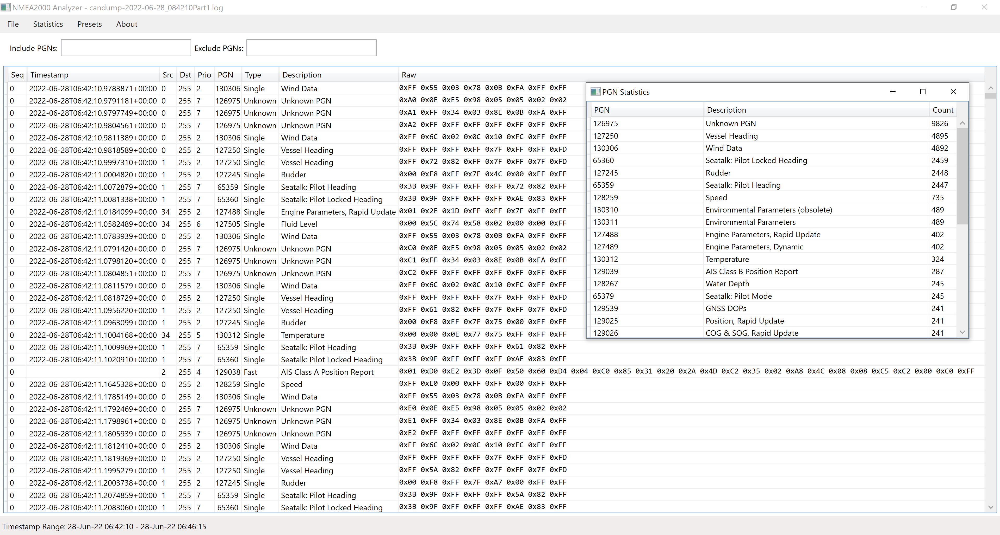
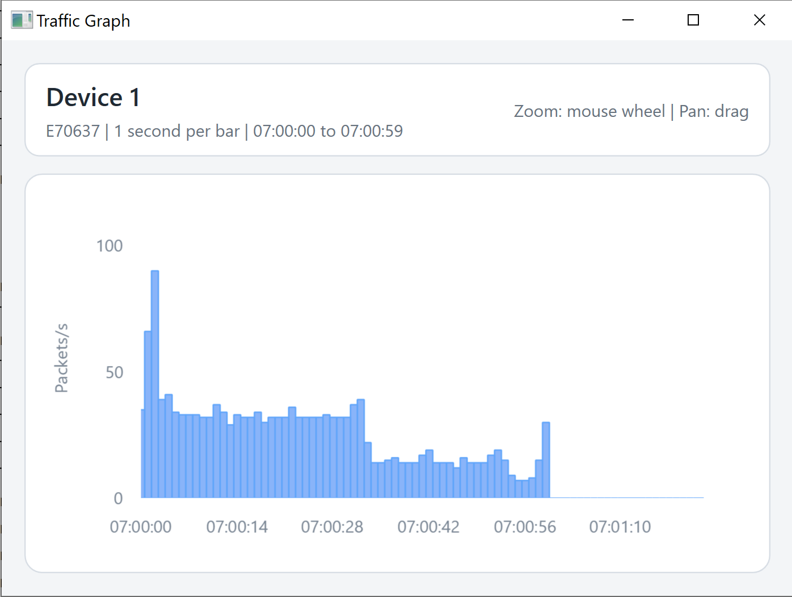
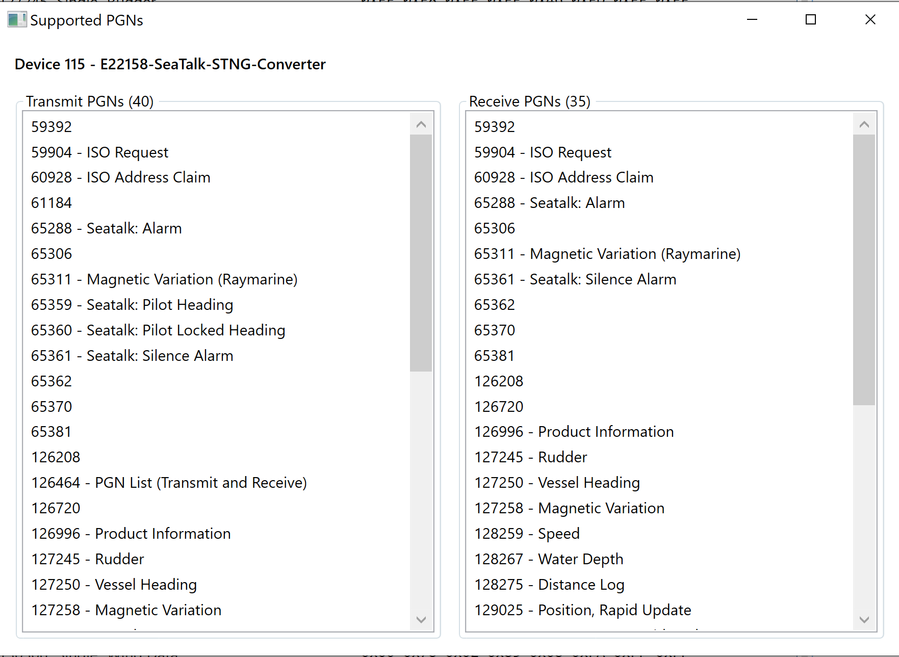

# NMEA2000-Analyzer

NMEA2000 log analyzer for Windows, using the canboat JSON definitions for PGN decoding.



## Platform

Windows 10/11 only

## Supported log formats

* TwoCan CSV
* Actisense
* CanDump
* Yacht Devices Wireless Gateway
* PCANView
* Yacht Devices CSV

## PGN Definitions

Custom PGN overrides can be added in `local.json`.

## Presets

You can define your own presets in `presets.json`.

## Live capture

Supported with CANable-compatible boards using the PCAN driver.
Saved captures are exported in candump format.

## Views

The main grid can switch between:

* `Assembled` packets
* `Unassembled` raw frames

## Statistics

In `Statistics`:

* double-click a row in `Devices` to open a packet-rate graph for that device
* double-click a row in `PGNs` to open a packet-rate graph for that PGN
* graphs are available only when the loaded log contains timestamps



In `Statistics -> Devices`:

* right-click a device row and choose `Supported PGNs` to see transmit and receive PGN lists learned from `126464`



## Highlighting

Optional PGN row highlights can be defined in `highlight.json` using web colors such as `#F8D7DA`.

## Export

`File -> Save` exports the full unassembled capture in candump format.

## Command line

You can open a file directly from the command line:

```powershell
NMEA2000Analyzer.exe "C:\path\to\capture.log"
```

The file is loaded on startup using the same detection logic as `File -> Open`.

For CLI-style validation and search commands:

```powershell
NMEA2000Analyzer.exe --summary "C:\path\to\capture.log"
NMEA2000Analyzer.exe --verify "C:\path\to\capture.log"
NMEA2000Analyzer.exe --search-pgn 126208
```

Commands:

* `--summary <file>` prints a JSON load summary
* `--verify <file>` loads the file and returns success/failure
* `--search-pgn <pgn>` searches all files in the current working directory and prints matching filenames
